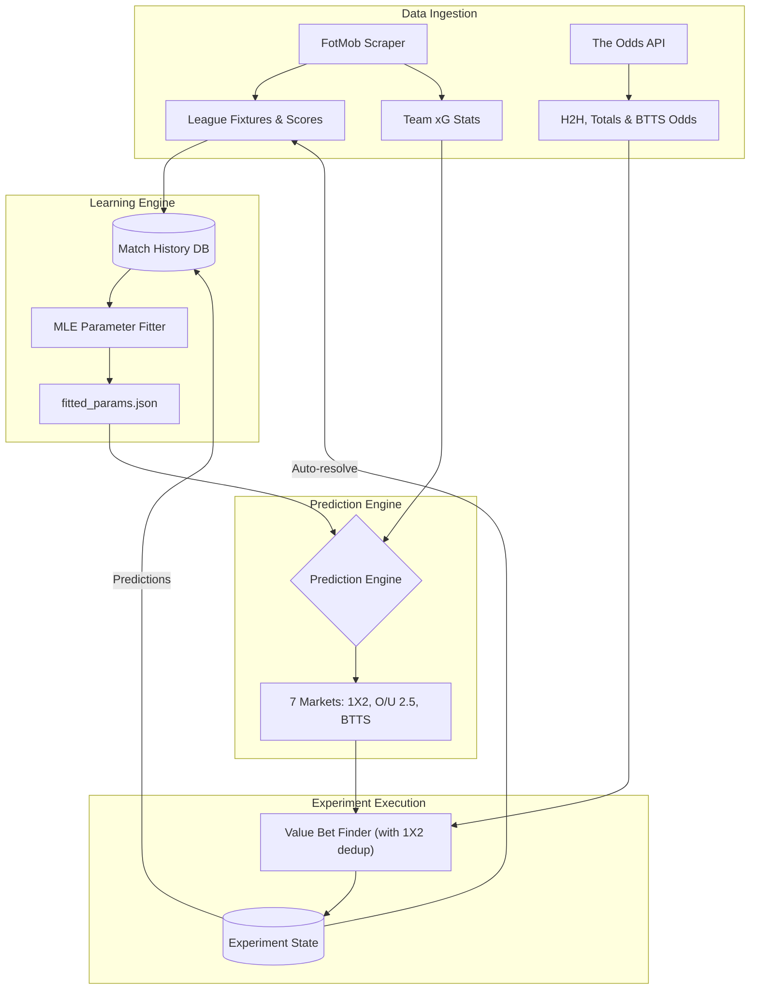

# 🧠 BetAI Model Architecture

This document describes the technical architecture of the BetAI prediction engine (v2.2), how it learns, and the roadmap for future improvements.

## 🏗️ Core Architecture

The system follows an **Ingestion → Storage → Fitting → Prediction → Execution** pipeline.

## 🛠️ The Prediction Model

The model is a **Dixon-Coles corrected Poisson model**. It predicts the probability of every possible scoreline (e.g., 0-0, 1-0, 2-1) up to 10 goals.

### Mathematical Foundation
For any match between Home ($H$) and Away ($A$):
- **Home Expected Goals** ($\lambda$): $\alpha_H \times \beta_A \times \text{HomeAdvantage}$
- **Away Expected Goals** ($\mu$): $\alpha_A \times \beta_H$

Where:
- $\alpha$: Attack strength
- $\beta$: Defensive weakness
- **HomeAdvantage**: Empirical factor (varies by league)

### Learning via MLE (Maximum Likelihood Estimation)
Unlike static models that just use averages, BetAI **fits** these parameters using historical data.
1. **Source**: ~1,200 matches from the current season.
2. **Method**: `scipy.optimize` finds the parameters that make the actual results most likely.
3. **Time Decay**: Recent matches carry more weight ($\text{half-life} = 180 \text{ days}$).
4. **Rho ($\rho$)**: Fits a correction factor for low-scoring games (e.g., 0-0, 1-1).

## 📊 Evaluation & Metrics

- **Brier Score**: Measures model accuracy (perfect = 0, average = 0.22).
- **Log-Loss**: Penalizes confident but wrong predictions.
- **Calibration**: Categorizes predictions into confidence bins to check if "60% predicted" actually results in 60% outcomes.

## 🚀 Future Roadmap

### Short Term
- **Closing Line Value (CLV)**: Tracking if we consistently beat the market.
- **Player-Level Data**: Adjusting team ratings based on key player injuries/lineups.

### Medium Term (Advanced Features)
- **In-Play Modeling**: Updating probabilities based on live match events.
- **Multi-Bookmaker Arbitrage**: Finding the best price across 10+ bookmakers.

### Long Term (Machine Learning Integration)
- **Neural Network Layer**: Using an RNN/Transformer to capture complex non-linear nuances that Poisson misses.
- **Reinforcement Learning**: Tuning the Kelly Criterion fraction based on historical bankroll performance.
